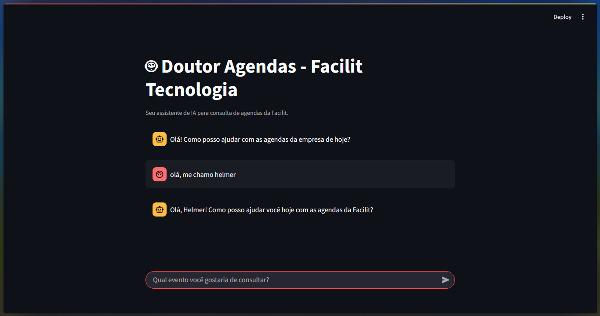
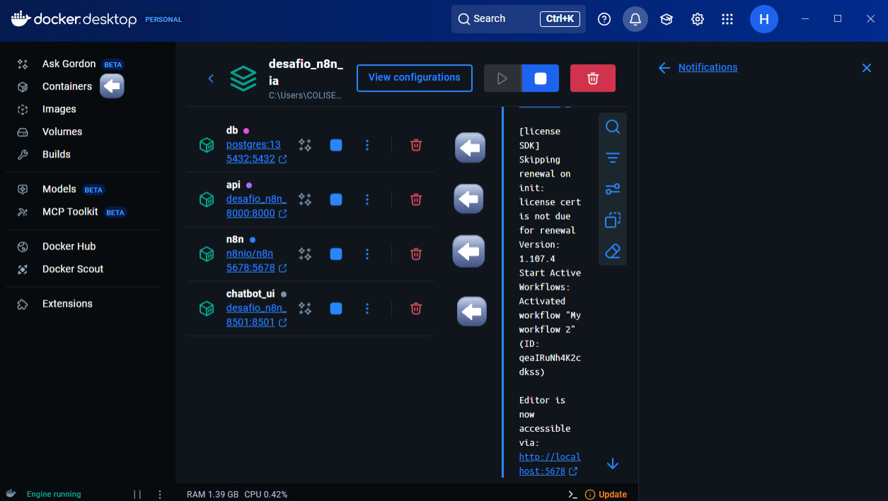

# Agente de IA com N8N, Docker e Streamlit

Este projeto utiliza o N8N em um ambiente Docker para criar um agente de IA — o **Dr. Agendas** — capaz de analisar e incluir dados de agendas dos setores da empresa **Facilit Tecnologia** em um banco de dados Postgres. O chatbot pode ser acessado por uma interface web desenvolvida com Streamlit (biblioteca python).

> Consulte o relatório final neste repositório para mais detalhes.

> Tutorial em vídeo do deploy abaixo.

[](https://youtu.be/BHcIdomeLrY)




## Deploy local

1. Instale o Docker ([link oficial](https://www.docker.com/get-started/)).
2. Clone este repositório na sua máquina:
    ```powershell
    cd pasta/local_desejado
    git clone -b ajustes_deploy --single-branch https://github.com/Helmelhor/desafio_n8n_ia.git
    ```
    > Certifique-se de estar na branch **ajustes_deploy**.

3. Entre na pasta do projeto e suba os containers:
    ```powershell
    docker-compose up
    ```
    > Isso inicia os containers definidos no **docker-compose.yml**.

### Possível erro com o banco de dados

Se o container do banco aparecer como **unhealthy**, é porque o banco leva alguns segundos para criar sua estrutura, mas o healthcheck do Docker Compose ocorre antes. Para corrigir:

1. Pare o Docker:
    ```powershell
    docker-compose down
    ```
2. Exclua a pasta **n8n_data**.
3. Suba novamente:
    ```powershell
    docker-compose up --build
    ```

Todos os containers (db, api, n8n e chatbot_ui) devem estar em execução. Confira na interface do Docker Desktop:



## Importando os Workflows

1. Baixe os dois arquivos JSON da pasta **workflows**.
2. Acesse o n8n pelo link exibido no terminal, faça login e importe cada JSON para um workflow diferente.

- **Migração de dados**: Executa a migração dos dados legados do Google Sheets para o Postgres via API. Basta rodar manualmente para popular o banco.
- **IA consulta eventos definitivo**: Workflow com webhook para receber inputs do usuário, processar pelo agente de IA e consultar/alterar o banco via API. Ative o workflow e teste com:
    ```powershell
    curl -X POST -H "Content-Type: application/json" -d "{\"pergunta\": \"crie um evento chamado do Rh 'confra fim de ano na data de 15/12/2025''\"}" http://localhost:5678/webhook-test/3abb36e0-3571-490f-8208-46b31b5c976b
    ```

## Aplicação Streamlit

Com os workflows ativos localmente, acesse o chatbot web, em:  
**http://localhost:8501/**
